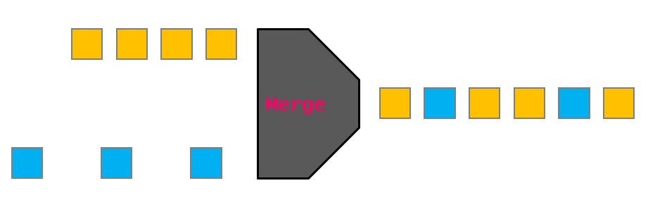
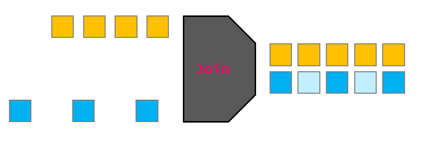
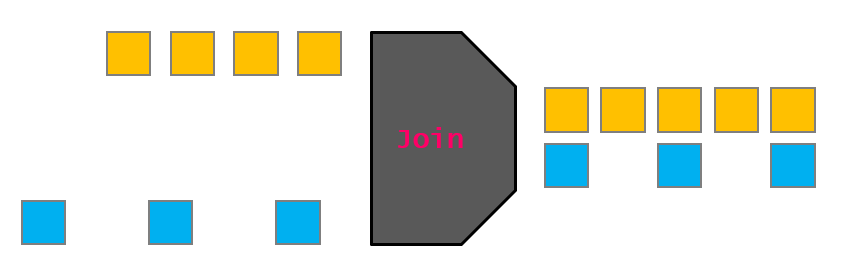

## Basic

This section describes the basic functionality of `stream-tools` and how to building your first scripts.

### The first agent

The basic feature of `stream-tools` is the `agent`.
Ideally, the agent is any function that could be registered and that has the following feature:
- is state-less: the function do its own stuff only based on the value provided by the stream;
- one stream as input: the function can work on only one stream;
- no stream as output: the function doesn't return any value;
- side-effect only: the function can execute side-effect stuff, such as printing the value to the stdout or sending the value to another database, etc.

Once a function is registered with the decorator `@app.agent`, it will be executed for each of the value in the stream.

The following examples are useful:
- [examples/basics/stream.py](https://github.com/deltaleap/stream-tools/tree/main/examples/basics/stream.py)
- [examples/basics/stream_to_pg.py](https://github.com/deltaleap/stream-tools/tree/main/examples/basics/stream_to_pg.py)

### Let's inflow new streams

### Merging two streams

### Joining two streams

#### Option 1: Update state
The joined stream conserve a state that it is updated at each observation from any upstream.
The joined stream emits the state at each update.

Flow example (see test [`test_join_update_state`]()):

<pre>
> <b>time 1</b> stream_1 emits 1
> <b>time 1</b> joined_stream emits [1, None]
> <b>time 2</b> stream_2 emits 2
> <b>time 2</b> joined_stream emits [1, 2]
> <b>time 8</b> stream_1 emits 5
> <b>time 8</b> joined_stream emits [5, 2]
</pre>

#### Option 2: Time catch
The joined stream conserve a state that it is update at each observation from any upstream.
The state is conserved with the data from a certain number of second since the moment of each observation.
The joined sream emits the state at each update.

Flow example (delta time: 3) (see test [`test_join_time_catch`](https://github.com/deltaleap/stream-tools/blob/main/tests/test_join.py)):

<pre>
> <b>time 1</b> stream_1 emits 1
> <b>time 1</b> joined_stream emits [1, None]
> <b>time 2</b> stream_2 emits 2
> <b>time 2</b> joined_stream emits [1, 2]
> <b>time 8</b> stream_1 emits 5
> <b>time 8</b> joined_stream emits [5, None]
> <b>time 10</b> stream_2 emits 3
> <b>time 10</b> joined_stream emits [5, 3]
> <b>time 15</b> stream_2 emits 9
> <b>time 15</b> joined_stream emits [None, 9]
</pre>

#### Option 3: Timeframe
> question: is it useful?

The joined stream conserva a state for a timeframe. The state conserve information from any upstream
that emits in the given timeframe.
The joined stream emits the state at the end of the timeframe.

This join method make lose the real-timeness.

Flow example (timeframe: 3):

<pre>
> <b>time 1</b> stream_1 emits 1
> <b>time 2</b> stream_2 emits 2
> <b>time 3</b> joined_stream emits [1, 2]
> <b>time 6</b> joined_stream emits [None, None]
> <b>time 8</b> stream_1 emits 5
> <b>time 9</b> joined_stream emits [5, None]
> <b>time 10</b> stream_2 emits 3
> <b>time 12</b> stream_1 emits 12
> <b>time 12</b> joined_stream emits [12, 3]
> <b>time 15</b> stream_2 emits 21
> <b>time 15</b> joined_stream emits [None, 21]
</pre>
